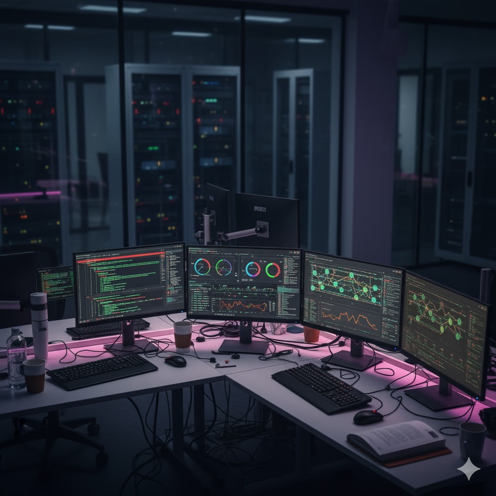

<h1 align="center"> 🖥️ Monitorización 🖥️ </h1>

---

--- 

## Índice
### [Unidad 1. Procesos](ud1/ud1.md)
### [Unidad 2. Memoria, Espacio y Rendimiento de disco](ud2/ud2.md)
### [Unidad 3. Tráfico de la Red](ud3/ud3.md)
### [Unidad 4. Puertos](ud4/ud4.md)
