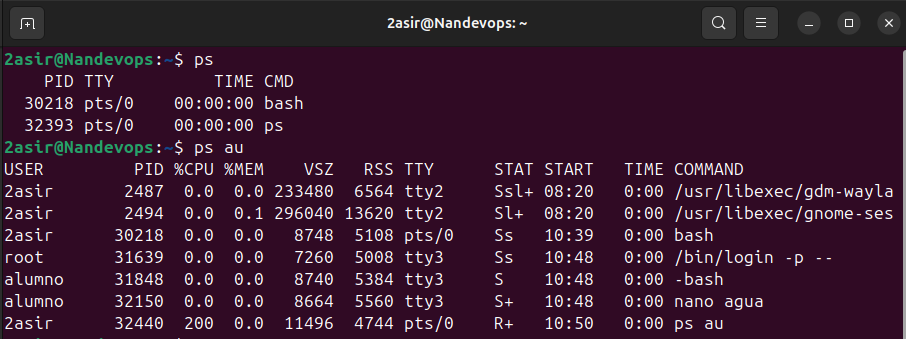
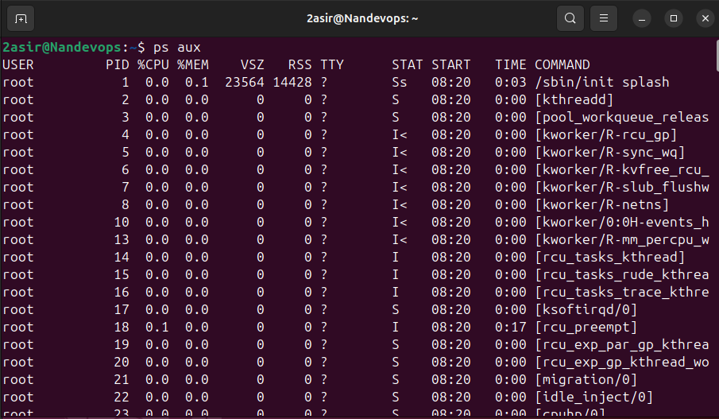
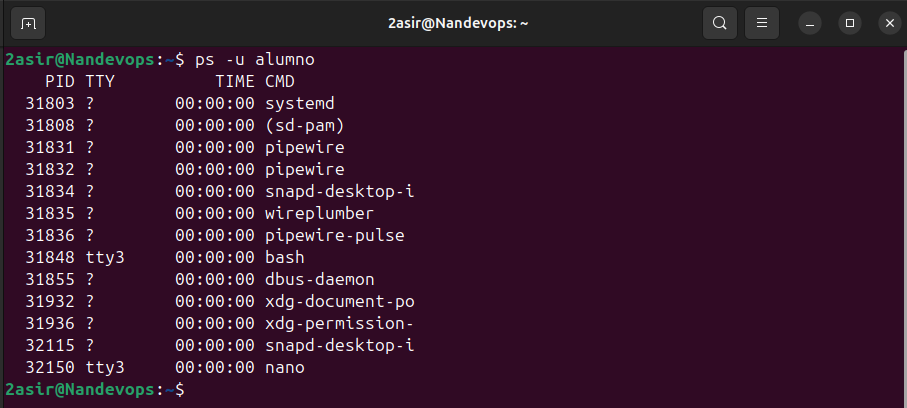
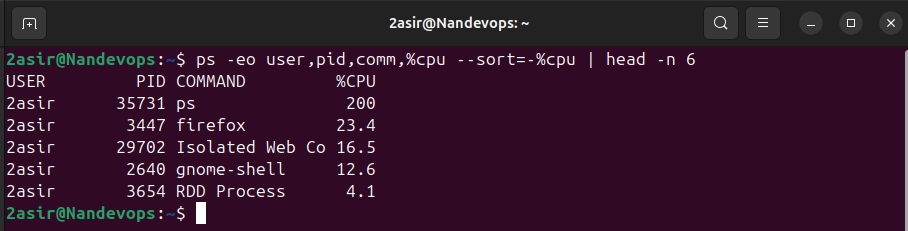
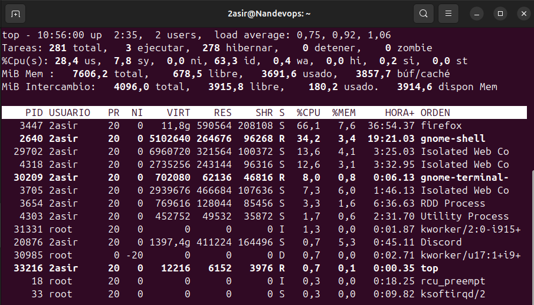
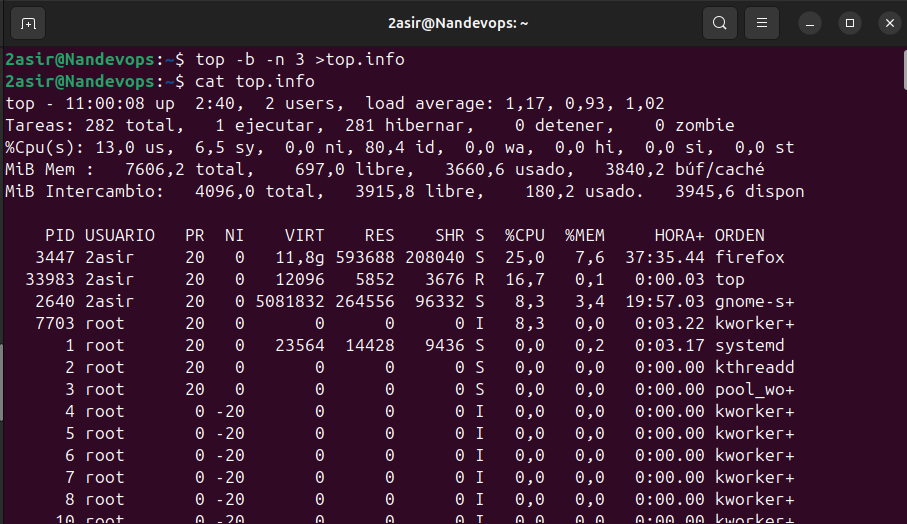
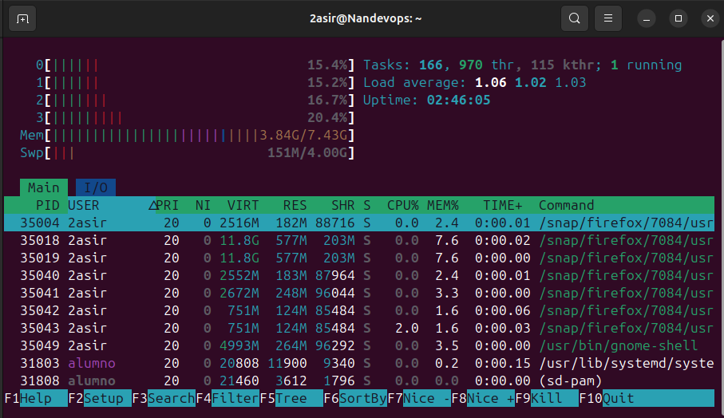

# [UNIDAD 1. PROCESOS](../README.md)
---

## Índice
### [Ir a comando PS](#1-ps)
### [Ir a comando TOP](#2-top)
### [Ir a comando HTOP](#3-htop)

---

## [1. `PS`](#índice)

- `ps` -> Muestra la información de los procesos activos.
- `ps au` -> Muestra procesos de todos los usuarios en formato extendido.

- `ps aux` -> Versión extendida que muestra todos los procesos ejecutados inclyendo los procesos del sistema, usuarios.

- `ps -u <alumno>` -> Filtra y muestra solo los procesos del usuario "alumno".

- `ps -eo user,pid,comm,%cpu --sort=-%cpu | head -n 6` -> Muestra los procesos del sistema con columnas personalizadas, filtrando por %cpu y las 6 primeras líneas.

---

## [2. `TOP`](#índice)

- `top` -> Proporciona una vista en tiempo real de los procesos que más recursos consumen (CPU y memoria).

- `top -b -n 3 >top.info` -> Ejecuta top en batch capturando 3 interaciones y los guarda en un archivo llamado 'top.info'.

---

## [3. `HTOP`](#índice)

- `htop` -> Versión mejorada de top, con interfaz visual y funciones adicionales, como desplazamiento y filtrado de procesos.

---
