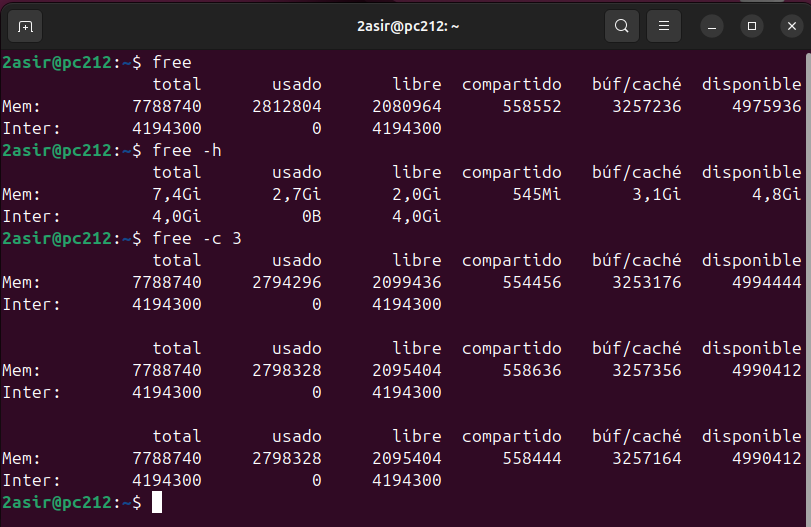
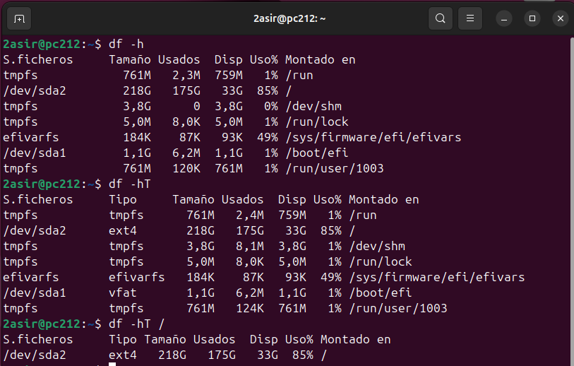
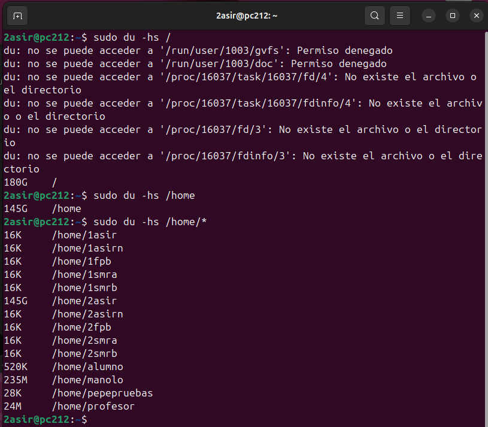
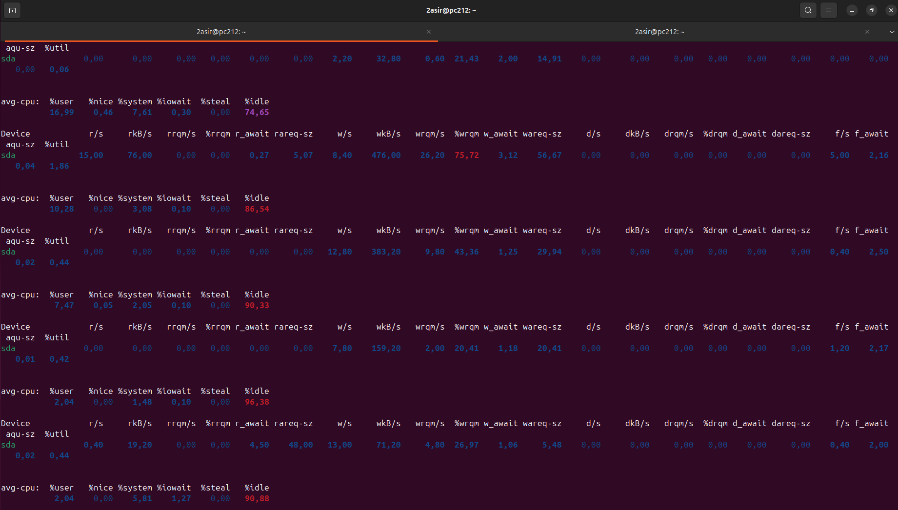

# [UNIDAD 2. MEMORIA, ESPACIO Y RENDIMIENTO EN DISCO](../README.md)

---

imagen

---

## Índice
### [Ir a comando FREE](#1-free)
### [Ir a comando DF](#2-df)
### [Ir a comando DU](#3-du)
### [Ir a comando IOSTAT](#4-iostat)

---

## 1. [`FREE`](#índice)

- `free` ->
- `free -h` ->
- `free -c 3` -> 

- `free -s 3` ->

---

## 2. [`DF`](#índice)

- `df -h` ->

---

## 3. [`DU`](#índice)

- `du -hs /` ->
- `du -hs /home` ->
- `du -hs /home/*` ->

---

## 4. [`IOSTAT`](#índice)

- `iostat -x <nombre_disco>` ->

