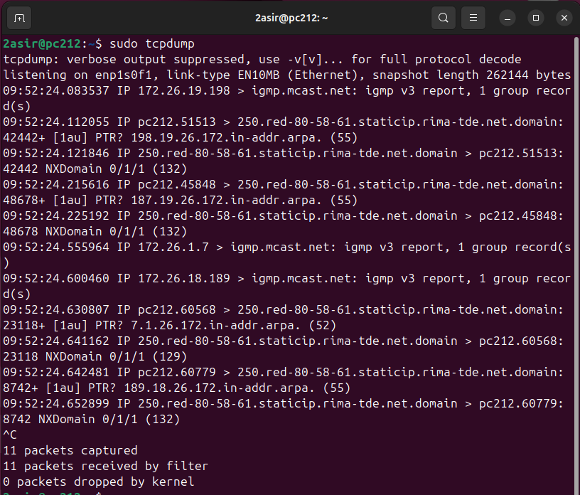
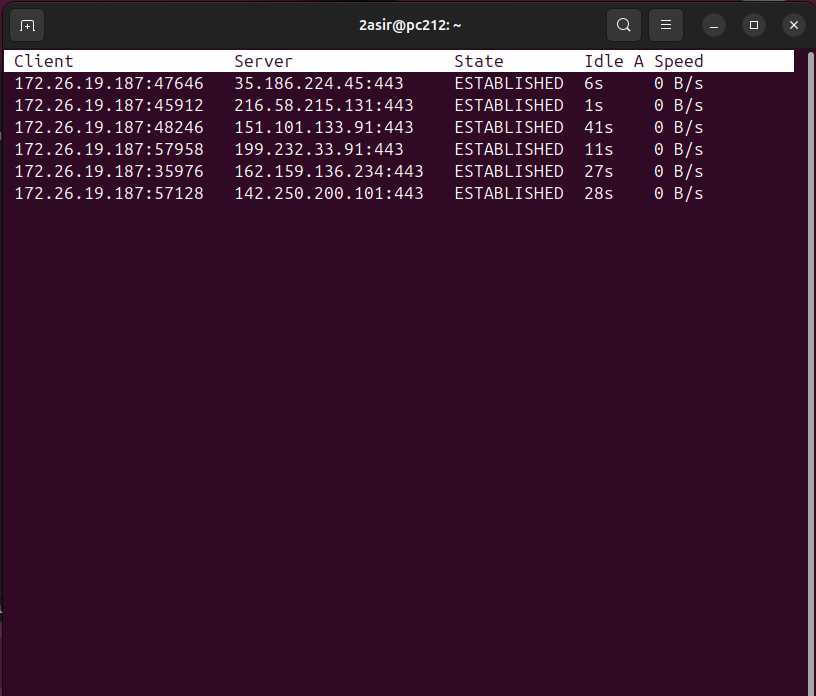
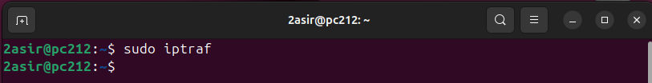
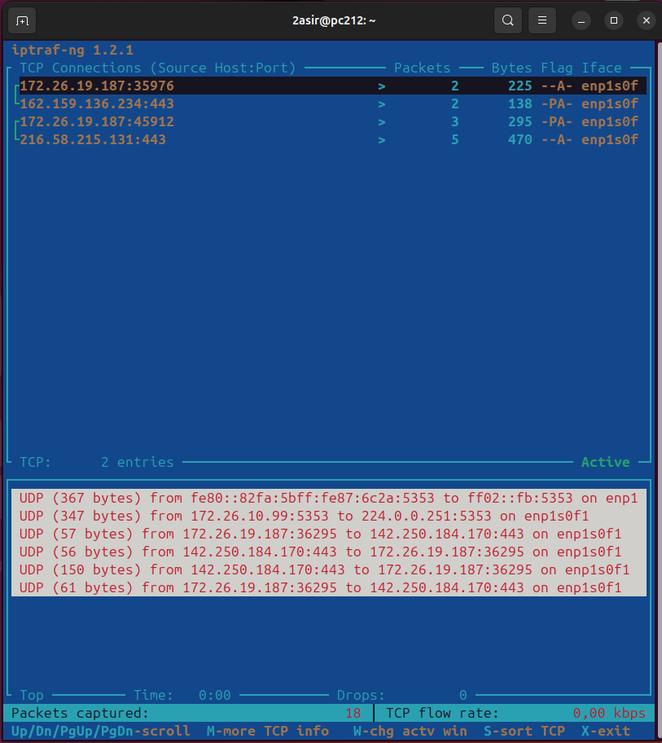
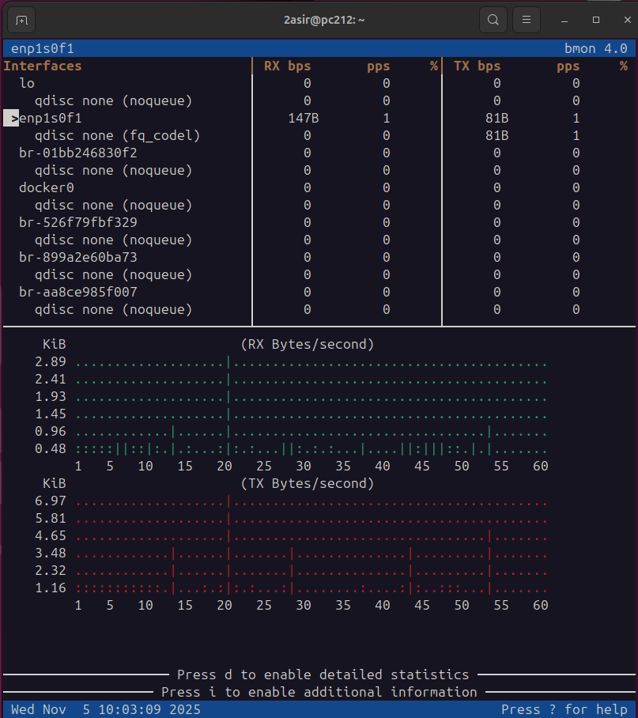

## [UNIDAD 3. TRÁFICO DE LA RED](../README.md)

---

### Índice
### [Ir a comando TCPDUMP](#1-tcpdump)
### [Ir a comando TCPTRACK](#2-tcptrack)
### [Ir a comando IPTRAF](#3-iptraf)
### [Ir a comando BMON](#4-bmon)

---

### 1. [`TCPDUMP`](#índice)

- `tcpdump` -> Realiza un análisis del tráfico de la red en tiempo real los paquetes transmitidos y recibidos. Se conoce como **sniffing**.

---

### 2. [`TCPTRACK`](#índice)

- `tcptrack -i <nombre_adaptador>` -> Monitorea las conexiones TCP establecidas en tiempo real indicando una interfaz de red específica.

- En el resultado observamos la **IP local**, la **IP server**, el **estado**, **tiempo** que lleva establecida y la **velocidad**.

---

### 3. [`IPTRAF`](#índice)

- `iptraf` -> Monitorea estadísticas y tráfico de red en una interfaz interactiva organizando la información de manera clara y detallada.

- En el resultado podemos ver un *menú* en la parte inferior, además de informar del **número de paquetes**, *IP origen y destino*, etc.

---

### 4. [`BMON`](#índice)

- `bmon` -> **Bandwidth Monitor** -> Permite monitorizar y depurar estadística de red en tiempo real con el uso de ancho de banda.
- En el resultado podemos *seleccionar* la interfaz de red que queremos ver en la parte inferior y así poder observar el tráfico que ha tenido tanto **trasmitido**, como **recibido**.

