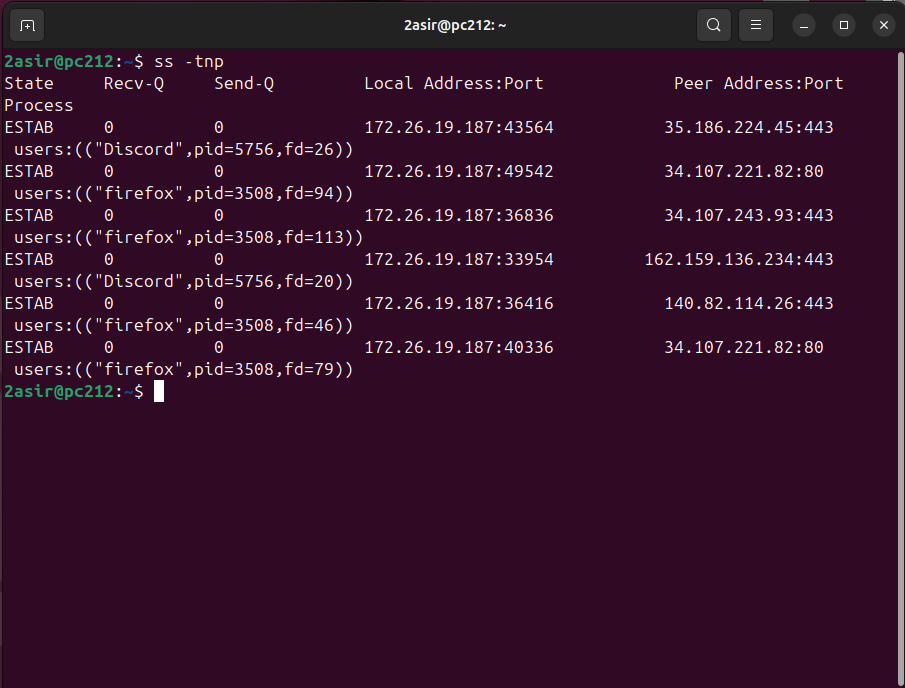
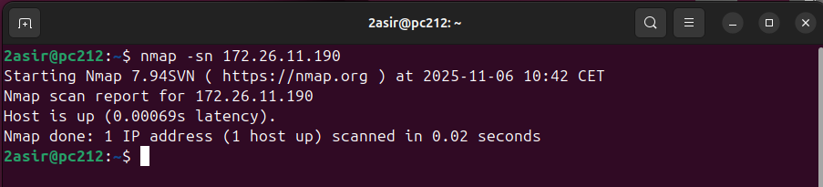
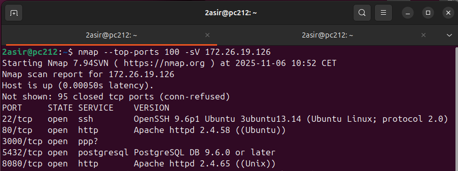
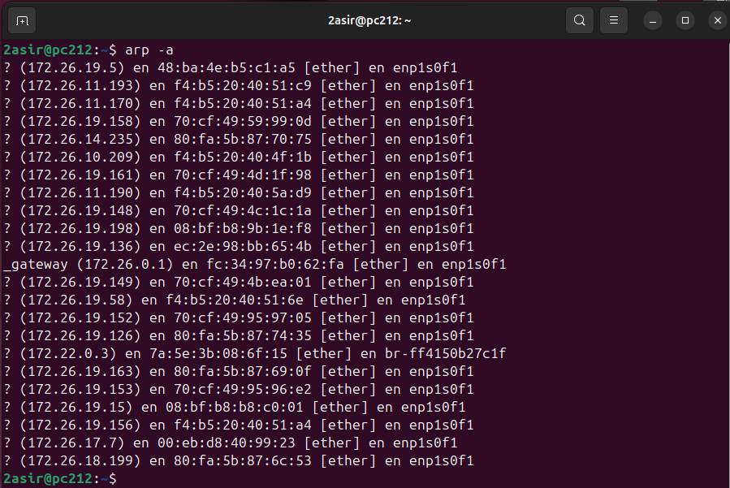
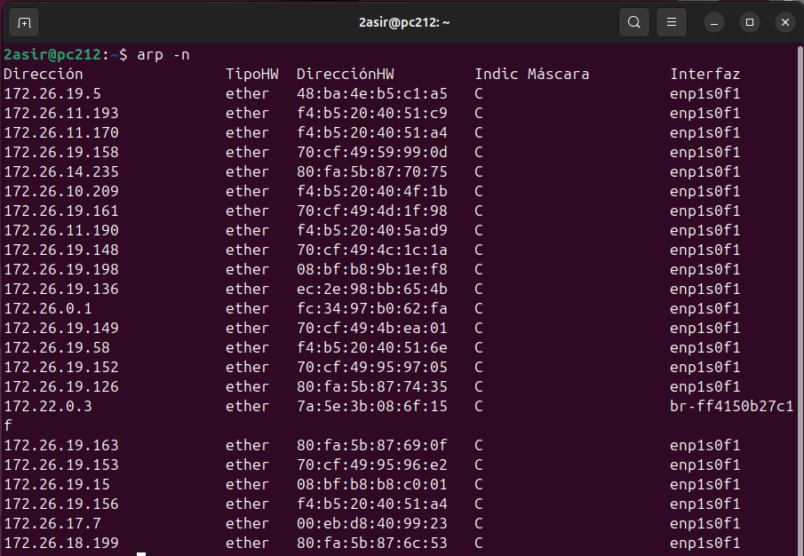
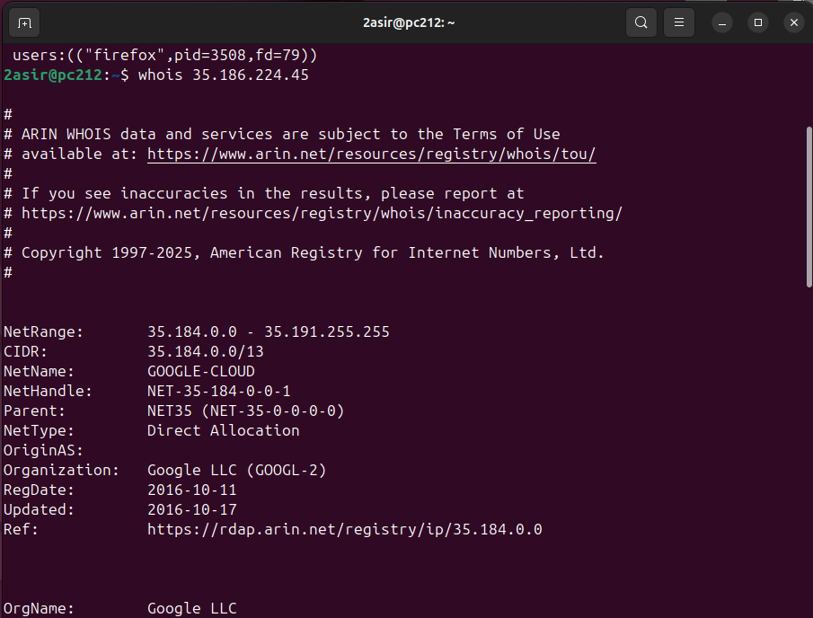

## [UNIDAD 4. PUERTOS](../README.md)

---

### Índice
### [Ir a comando SS](#1-ss)
### [Ir a comando NMAP](#2-nmap)
### [Ir a comando ARP](#3-arp)
### [Ir a comando WHOIS](#4-whois)

---

### 1. [`SS`](#índice)

- `ss` -> Es una herramienta moderna que inspecciona y muestra información detallada sobre las conexiones de red. Útil para ver los **puertos**, **conexiones activas** y estadísticas **TCP/UDP**.

#### Tabla de Opciones

| Opción | Significado | Función |
|--------|-------------|---------|
| `-t` | TCP | Muestra solo sockets TCP. |
| `-u` | UDP | Muestra solo sockets UDP. |
| `-l` | Listening | Muestra solo los sockets que están escuchando (servidores). |
| `-a` | All | Muestra todos los sockets (escuchando y establecidos/conectados). |
| `-n` | Numeric | Muestra los números de puerto y direcciones IP numéricamente (más rápido, ya que omite la resolución DNS). |
| `-p` | Process | Muestra el nombre y ID del proceso (PID) que utiliza el socket. |
| `-s` | Summary | Muestra un resumen conciso de las estadísticas de los sockets. |

- `ss -plunt` -> Muestra una lista detallada de todos los sockets de red (TCP y UDP) que están en estado de "escucha" (listening), incluyendo el nombre del programa y su ID de proceso (PID) asociados.

- `ss -tnp` -> Muestra un listado de todas las conexiones TCP (establecidas y escuchando), presentando las direcciones y puertos numéricamente, e identificando el programa y su PID asociados a cada conexión.

---

### 2. [`NMAP`](#índice)

- `nmap` -> Es una herramienta que explora las redes y audita la seguridad en la que se pueden **escanear puertos**, **descubrir hosts**, **sistemas operativos**, etc.
- `nmap -sn <IP>` -> Es el comando utilizado para el escaneo de host o escaneo "rápido" como un ping, para ver que hosts están activos (UP).

- `nmap --top-ports 100 -sV <IP>` ->  Escanea vulnerabilidades identificando los 100 puertos TCP más comunes y su versión exacta.

---

### 3. [`ARP`](#índice)

- `arp` -> Es una utilidad utilizada para visualizar y modificar la tabla de caché ARP.
- `arp -a` -> Muestra el contenido completo de la tabla ARP del sistema. Nos da la información de la IP y de la MAC de los dispositivos comunicados con nuestra máquina.

- `arp -n` -> Muestra el contenido de la tabla ARP de forma rápida ya que omite la resolución de nombres de host.

---

### 4. [`WHOIS`](#índice)

- `whois <IP>` -> Consulta bases de datos públicas para obtener la información de registro sobre una IP o un nombre de dominio.

---

### [Unidad 3 <- Anterior](../ud3/ud3.md)
